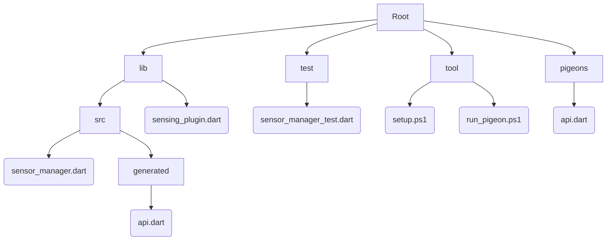

# Overview

- Branch naming
- Code style guide
  - Dart
  - Kotlin
  - Swift
- Versioning and Changelog
- Markdown style guide
- Git hooks
- Review process
- Development setup
- Project structure

## Branch naming

The name of a branch consists of: `<Prefix>/<Issue ID>-<Issue Name>`

**Prefix**

The prefix is one of the commit types from [Conventional Commits](https://www.conventionalcommits.org/en/v1.0.0/), so e.g. a bug fix branch would be named **fix/...**.

Additionaly there's the prefix `investigate` for investigating e.g. plugins, architectures.

**Issue ID**

Just the ID of the issue.

**Issue Name**

Name of the issue in lowercase with whitespaces replaced by hyphens e.g. **add-new-feature**

### Examples

* `fix/1-fix-big-bug`
* `feat/2-add-new-feature`
* `docs/3-add-description-in-readme`
* `investigate/4-investigate-server-connection-plugin`

### Workflow

1. Navigate to the issue for which you want to create a branch.
2. Click the down arrow next to `Create merge request`.
3. Choose if you just want to create a branch or additionally create a MR.
4. GitLab has automatically created `<Issue ID>-<Issue Name>` and you just have to add the `<prefix>/` part.
5. Click `Create merge request` or `Create branch` according to your previous choice.

## Code style guide - **Dart**

We follow the rules of [Effective Dart](https://dart.dev/guides/language/effective-dart) and use the [flutter_lints package](https://pub.dev/packages/flutter_lints) as recommended set of linter rules. They are enforced by the [Dart Formatter](https://pub.dev/packages/dart_style) and the [Dart Analyzer](https://pub.dev/packages/analyzer).

Formatting can be automatically done on save when the following is included in the workspace settings (`./.vscode/settings.json`):

`"editor.formatOnSave": true,`

## Code style guide - **Kotlin**

We follow the rules of the [Kotlin coding conventions](https://kotlinlang.org/docs/coding-conventions.html) and the [Android Kotlin style guide](https://developer.android.com/kotlin/style-guide). Both are enforced by [ktlint](https://pinterest.github.io/ktlint/) which is in some aspects more strict[\*](https://github.com/pinterest/ktlint/issues/284#issuecomment-425177186). The linter respects the `.editorconfig` file and can be customized if needed.

## Code style guide - Swift

We follow the rules of the [Official raywenderlich.com Swift style guide](https://github.com/kodecocodes/swift-style-guide) which is enforced by [SwiftLint](https://github.com/realm/SwiftLint). The linter can be added to XCode as Build Tool Plugin and there are plugins for [AppCode](https://plugins.jetbrains.com/plugin/9175-swiftlint/) and [VSCode](https://marketplace.visualstudio.com/items?itemName=vknabel.vscode-swiftlint).

## Versioning and Changelog

Our projects `Smart Sensing Library` and `Sensing Plugin` adhere to [Semantic Versioning (SemVer)](https://semver.org/spec/v2.0.0.html). The style guide we use for our changelog is [Common Changelog](https://common-changelog.org/).

Example CHANGELOG.md:

```markdown
# Changelog

## [0.2.1] - 2022-12-24

### Fixed

- Fixed big bug ([#16](https://gitlab.uni-ulm.de/se-anwendungsprojekt-22-23/smart-sensing-library/-/issues/42)) (Angela Merkel)

## [0.2.0] - 2022-12-12

### Changed

- Changed functionality ([#69](https://gitlab.uni-ulm.de/se-anwendungsprojekt-22-23/smart-sensing-library/-/issues/69)) (Johnny Sins)

### Added

- Added new feature ([#42](https://gitlab.uni-ulm.de/se-anwendungsprojekt-22-23/smart-sensing-library/-/issues/42)) (Zaphod Beeblebrox)

## [0.1.0] - 2022-11-16

_Initial release._

[0.2.1]: <https://gitlab.uni-ulm.de/se-anwendungsprojekt-22-23/smart-sensing-library/-/releases/0_2_1>
[0.2.0]: <https://gitlab.uni-ulm.de/se-anwendungsprojekt-22-23/smart-sensing-library/-/releases/0_2_0>
[0.1.0]: <https://gitlab.uni-ulm.de/se-anwendungsprojekt-22-23/smart-sensing-library/-/releases/0_1_0>
```

### Release workflow

1. Create new issue and MR to release new version
2. Update `CHANGELOG.md`
3. Update the version in `pubspec.yaml`
4. Commit, push and merge changes
5. Create release tag to corresponding commit
6. Create release in [GitLab Releases](https://gitlab.uni-ulm.de/se-anwendungsprojekt-22-23/smart-sensing-library/-/releases) from release tag
7. optional: Update git submodules

## Markdown style guide

GitLab provides some informations how they test there documentation: [GitLab documentation testing](https://docs.gitlab.com/ee/development/documentation/testing.html).

Linters which we can use are [markdownlint](https://github.com/DavidAnson/markdownlint) and [Vale](https://vale.sh/).

markdownlint has an [extension for Visual Studio Code](https://marketplace.visualstudio.com/items?itemName=DavidAnson.vscode-markdownlint). Vale has [one](https://marketplace.visualstudio.com/items?itemName=errata-ai.vale-server) as well.

[This](https://gitlab.com/gitlab-org/gitlab/-/blob/master/scripts/lint-doc.sh) could be an example for documentation linting to improve our documentation.

## Git hooks

We can add pre-commit and pre-push hooks to reduce the feedback loop using [lefthook](https://github.com/evilmartians/lefthook).

Once configured it can e.g. check in pre-commit that the formatting and linting is correct and in pre-push run unit tests.

## Review process

1. Checkout branch locally
2. Test added feature/fixed bug
3. Check if changes comply to style guides
4. If you want to comment on something, don't click "Add Comment now" in the MR, but "Start a review" (otherwise the assignee receives an email for each comment)
5. If your review is finished click "Finish review" and eventually add a final comment e.g. "LGTM", "minor improvements required", ...
6. Add code independent comments as thread, so that the assignee has to answer your comment
7. **DON'T** close the threads as assignee, only the reviewers resolve their own threads.
8. **DO** answer an every comment, so that the reviewer sees that you saw the comment. This can be as simple as e.g. "Fixed it", "Added it", "Thanks for the advice".

## Development setup

We use different editors/IDEs for each platform/language:

* Flutter/Dart: [Visual Studio Code](https://code.visualstudio.com/)
* Android/Kotlin: [Android Studio](https://developer.android.com/studio/)
* iOS/Swift: [XCode](https://developer.apple.com/xcode/)

Android Studio and XCode are only required when working on the [Sensing Plugin](https://gitlab.uni-ulm.de/se-anwendungsprojekt-22-23/sensing-plugin).

### Editor/IDE setup

**Visual Studio Code**

Install recommended plugins listed in `.\.vscode\extensions.json`:

1. Go to Extensions Tab
2. Enter `@recommended` into the search bar
3. Install every plugin listed under `Workspace Recommendations`

 **Android Studio (Sensing Plugin)**

**DON'T** open `.\android\` or `.\example\` as workspace directory.

1. **DO** open `.\example\android\` so that dependencies are recognized.
1. In the project view (with `Android` selected) three modules are shown: `app`, `sensing_plugin` and `Gradle Scripts`.
1. `app` contains the code for the example and `sensing_plugin` the code for the plugin.
1. Enable EditorConfig support by navigating to `Settings` -> `Editor` -> `Code Style` and check `Enable EditorConfig support`

**XCode (Sensing Plugin)**

**DON'T** open Xcode via right-clicking on the `.\example\ios\` folder and click "Open in Xcode".

1. **DO** open Xcode directly.
1. Click "Open..." or "Cmd + O".
1. Open the `.\example\ios\Runner.xcworkspace`.
1. All things should be initialized automatically.

### Repository setup

We use scripts to execute shell commands for the project setup or to generate code:

* On Linux/MacOS run: `bash <file name>`
* On Windows run: `.\<file name>` Note: They are powershell scripts but work as bash script as well.

For the setup on the [Sensing Plugin](https://gitlab.uni-ulm.de/se-anwendungsprojekt-22-23/sensing-plugin) and [Smart Sensing Library](https://gitlab.uni-ulm.de/se-anwendungsprojekt-22-23/smart-sensing-library) run the `setup.ps1` script.

**Sensing Plugin**

We use the [Pigeon package](https://pub.dev/packages/pigeon) to generate API code for each platform. If you edit \[Insert pigeon file here e.g. `.\pigeons\messages.dart`\] run the `pigeon.ps1` script.

**Smart Sensing Library**

We use the [ObjectBox package](https://pub.dev/packages/objectbox) as database system. If you edit \[Inset object box file here\] run the `objectbox.ps1` script.

## Project structure

Dart provides a [guide](https://dart.dev/guides/libraries/create-library-packages) on how to design a good project structure which we should follow. The following graph should be a basic design of how this would apply on our projects.


