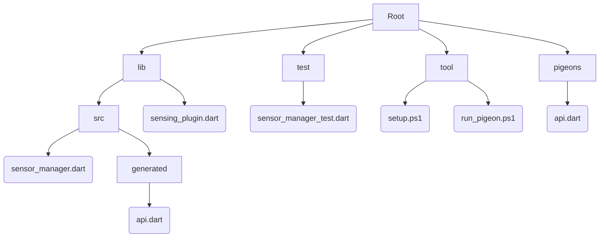

# Overview

- [Branch naming](#branch-naming)
- [Code style guide](#code-style-guide)
  - [Dart](#dart)
  - [Kotlin](#kotlin)
  - [Swift](#swift)
- [Documentation](#documentation)
  - [Dart](#dart-documentation)
  - [Kotlin](#kotlin-documentation)
  - [Swift](#swift-documentation)
- [Conventional Commits](#conventional-commits)
- [Versioning and Changelog](#versioning-and-changelog)
- [Markdown style guide](#markdown-style-guide)
- [Git hooks](#git-hooks)
- [Review process](#review-process)
- [Development setup](#development-setup)
- [Project structure](#project-structure)

## Branch naming

The name of a branch consists of: `<Prefix>/<Issue ID>-<Issue Name>`

**Prefix**

The prefix is one of the commit types from [Conventional Commits](https://www.conventionalcommits.org/en/v1.0.0/), so e.g. a bug fix branch would be named **fix/...**.

Additionaly there's the prefix `investigate` for investigating e.g. plugins, architectures.

**Issue ID**

Just the ID of the issue.

**Issue Name**

Name of the issue in lowercase with whitespaces replaced by hyphens e.g. **add-new-feature**

### Examples

* `fix/1-fix-big-bug`
* `feat/2-add-new-feature`
* `docs/3-add-description-in-readme`
* `investigate/4-investigate-server-connection-plugin`

### Workflow

1. Navigate to the issue for which you want to create a branch.
2. Click the down arrow next to `Create merge request`.
3. Choose if you just want to create a branch or additionally create a MR.
4. GitLab has automatically created `<Issue ID>-<Issue Name>` and you just have to add the `<prefix>/` part.
5. Click `Create merge request` or `Create branch` according to your previous choice.

## Code style guide 
### Dart
We follow the rules of [Effective Dart](https://dart.dev/guides/language/effective-dart) and use the [flutter_lints package](https://pub.dev/packages/flutter_lints) as recommended set of linter rules.
They are enforced by the [Dart Formatter](https://pub.dev/packages/dart_style) and the [Dart Analyzer](https://pub.dev/packages/analyzer).

Formatting can be automatically done on save when the following is included in the workspace settings (`./.vscode/settings.json`):
```json
"editor.formatOnSave": true,
```
[All linter rules](https://dart.dev/tools/linter-rules)

**Additional rules**
<details>
<summary>Click to expand</summary>

### **DO** declare return types.
linter rule: [`always_declare_return_types`](https://dart.dev/tools/linter-rules#always_declare_return_types).

### **AVOID** bool literals in conditional expressions.
linter rule: [`avoid_bool_literals_in_conditional_expressions`](https://dart.dev/tools/linter-rules#avoid_bool_literals_in_conditional_expressions).

### **AVOID** classes with only static members.
linter rule: [`avoid_classes_with_only_static_members`](https://dart.dev/tools/linter-rules#avoid_classes_with_only_static_members).

### **AVOID** returning null for the return types `bool`, `double`, `int` or `num`.
linter rule: [`avoid_returning_null`](https://dart.dev/tools/linter-rules#avoid_returning_null).

### **AVOID** returning null for `Future`.
linter rule: [`avoid_returning_null_for_future`](https://dart.dev/tools/linter-rules#avoid_returning_null_for_future).

### **AVOID** unused constructor parameters.
linter rule: [`avoid_unused_constructor_parameters`](https://dart.dev/tools/linter-rules#avoid_unused_constructor_parameters).

### **AVOID** async functions that return void.
linter rule: [`avoid_void_async`](https://dart.dev/tools/linter-rules#avoid_void_async).

### **DO** use cascade invocations.
linter rule: [`cascade_invocations`](https://dart.dev/tools/linter-rules#cascade_invocations).

### **DON'T** cast a nullable value to a non-nullable value.
linter rule: [`cast_nullable_to_non_nullable`](https://dart.dev/tools/linter-rules#cast_nullable_to_non_nullable).

### **DON'T** invoke asynchronous functions in non-async blocks.
linter rule: [`discarded_futures`](https://dart.dev/tools/linter-rules#discarded_futures).

### **DO** await methods that return a `Future` inside of an async method body.
linter rule: [`unawaited_futures`](https://dart.dev/tools/linter-rules#unawaited_futures).

### **DON'T** test for conditions composed only by literals, since the value can be inferred at compile time.
linter rule: [`literal_only_boolean_expressions`](https://dart.dev/tools/linter-rules#literal_only_boolean_expressions).

### **DO** only throw instances of classes extending either `Exception` or `Error`.
linter rule: [`only_throw_errors`](https://dart.dev/tools/linter-rules#only_throw_errors).

### **DON’T** assign new values to parameters of methods or functions.
linter rule: [`parameter_assignments`](https://dart.dev/tools/linter-rules#parameter_assignments).

### **PREFER** asserts with message.
linter rule: [`prefer_asserts_with_message`](https://dart.dev/tools/linter-rules#prefer_asserts_with_message).

### **DO** use trailing commas for all function calls and declarations.
linter rule: [`require_trailing_commas`](https://dart.dev/tools/linter-rules#require_trailing_commas).

### **DO** use trailing commas on all tree structures longer than one line.
Without trailing commas, code that builds widget trees or similar types of code tends to be hard to read. Adding the trailing commas allows `dart format` to do its job correctly.

Without trailing commas:
```dart
Expanded(
    child: Center(child: Container(width: 64.0, height: 64.0, child: Text("That's a Text"))),
)
```
With trailing commas:
```dart
Expanded(
    child: Center(
        child: Container(
            width: 64.0,
            height: 64.0,
            child: Text("That's a Text"),
        ),
    ),
)
```

### **DO** test type arguments in operator `==(Object other)`.
linter rule: [`test_types_in_equals`](https://dart.dev/tools/linter-rules#test_types_in_equals).

### **AVOID** `throw` in `finally` block.
linter rule: [`throw_in_finally`](https://dart.dev/tools/linter-rules#throw_in_finally).

### **AVOID** unnecessary `await` in return.
linter rule: [`unnecessary_await_in_return`](https://dart.dev/tools/linter-rules#unnecessary_await_in_return).

### **AVOID** unnecessary `final` for local variables.
linter rule: [`unnecessary_final`](https://dart.dev/tools/linter-rules#unnecessary_final).

### **AVOID** unnecessary null aware operator on extension on a nullable type.
linter rule: [`unnecessary_null_aware_operator_on_extension_on_nullable`](https://dart.dev/tools/linter-rules#unnecessary_null_aware_operator_on_extension_on_nullable).

### **AVOID** unnecessary null checks.
linter rule: [`unnecessary_null_checks`](https://dart.dev/tools/linter-rules#unnecessary_null_checks).

### **AVOID** unnecessary paranthesis.
linter rule: [`unnecessary_parenthesis`](https://dart.dev/tools/linter-rules#unnecessary_parenthesis).

### **AVOID** unnecessary raw strings.
linter rule: [`unnecessary_raw_strings`](https://dart.dev/tools/linter-rules#unnecessary_raw_strings).

### **AVOID** unnecessary statements.
linter rule: [`unnecessary_statements`](https://dart.dev/tools/linter-rules#unnecessary_statements).

### **AVOID** unnecessary `toList()` in spreads.
linter rule: [`unnecessary_to_list_in_spreads`](https://dart.dev/tools/linter-rules#unnecessary_to_list_in_spreads).

### **DO** use enums where appropriate.
linter rule: [`use_enums`](https://dart.dev/tools/linter-rules#use_enums).

### **PREFER** the use of `intValue.isOdd/isEven` to check for evenness.
linter rule: [`use_is_even_rather_than_modulo`](https://dart.dev/tools/linter-rules#use_is_even_rather_than_modulo).

### **PREFER** the use of predefined named constants.
linter rule: [`use_named_constants`](https://dart.dev/tools/linter-rules#use_named_constants).

## **DO** use raw string to avoid escapes.
linter rule: [`use_raw_strings`](https://dart.dev/tools/linter-rules#use_raw_strings).

### **DO** use super-initializer parameters where possible.
linter rule: [`use_super_parameters`](https://dart.dev/tools/linter-rules#use_super_parameters).

### **DO** use the `throwsA` matcher instead of try-catch with `fail()`.
linter rule: [`use_test_throws_matchers`](https://dart.dev/tools/linter-rules#use_test_throws_matchers).

### **CONSIDER** exporting publicly visible classes in a single .dart file.
For multiple classes that are used together but are in different files, it’s more convenient for users of your library to import a single file rather many at once. If the user wants narrower imports they can always restrict visibility using the `show` keyword.

This also helps minimize the publicly visible surface.

Example:
```dart
/// In src/apple.dart
class Apple {}

/// In src/orange.dart
class Orange {}

/// In src/veggies.dart
class Potato {}
class Tomato {}

/// In botanical_fruits.dart
export 'src/apple.dart';
export 'src/orange.dart';
// Can also be: export 'src/veggies.dart' hide Potato;
export 'src/veggies.dart' show Tomato;

/// In squeezer.dart
import 'package:plants/botanical_fruits.dart' show Orange;
```

### **DO** use namespacing when there is ambiguity, e.g. in class names.
There are often functions or classes that can collide, e.g. File or Image. If you don't namespace, there will be a compile error.

Good:
```dart
import 'dart:ui' as ui;

import 'package:flutter/material.dart';
...

ui.Image(...) ...
```
Bad:
```dart
import 'dart:ui';

import 'package:flutter/material.dart';
...

Image(...) ... // Which Image is this?
```

### **PREFER** to use show if you only have a few imports from that package. Otherwise, use as.
Using `show` can avoid collisions without requiring you to prepend namespaces to types, leading to cleaner code.

Good:
```dart
import 'package:fancy_style_guide/style.dart' as style;
import 'package:flutter/material.dart';
import 'package:math/simple_functions.dart' show Addition, Subtraction;
```
Bad:
```dart
import 'package:flutter/material.dart' show Container, Row, Column, Padding,
  Expanded, ...;
```

### **PREFER** to use `const` over `final` over `var`.
This minimizes the mutability for each member or local variable.

### **PREFER** return `Widget` instead of a specific type of Flutter widget.
As our project evolves, we may change the widget type that is returned in a function. For example, we might wrap a widget with a Center. Returning Widget simplifies the refactoring, as the method signature wouldn't have to change.

### **PREFER** storing state in Models instead of state.
When storing state that Flutter widgets need to access, prefer to use `ScopedModel` and `ScopedModelDescendant` instead of `StatefulWidget`. A `StatefulWidget` should contain only internal widget state that can be lost without any consequences.

Examples of stuff to store in a `ScopedModel`:
- User selections
- App state
- Anything that needs to be shared by widgets

Examples of stuff to store in a `StatefulWidget`'s State:
- Animation state that doesn't need to be controlled

### **AVOID** mixing named and positional parameters.
Instead, `@required` should be used in place of required positional parameters.

### **PREFER** named parameters.
In most situations, named parameters are less error prone and easier to read than positional parameters, optional or not. They give users to pass in the parameters in whatever order they please, and make Flutter trees especially clearer.

</details>

**Investigation note**
<details>
<summary>Click to expand</summary>

Linter rules we might want to include as well (but I didn't think they were absolutely necessary):
Feel free to check them out.
```yaml
- always_put_control_body_on_new_line
- avoid_annotating_with_dynamic
- avoid_dynamic_calls
- avoid_implementing_value_types
- avoid_type_to_string
- cancel_subscriptions                  # maybe needed for plugin
- close_sinks                           # maybe needed for plugin
- collection_methods_unrelated_type
- deprecated_consistency
- do_not_use_environment
- join_return_with_assignment
- leading_newlines_in_multiline_strings
- no_adjacent_strings_in_list
- prefer_asserts_in_initializer_lists
- prefer_constructors_over_static_methods
- prefer_final_in_for_each
- prefer_foreach
- sized_box_shrink_expand               # only needed for Demo
- use_colored_box                       # only needed for Demo
- use_decorated_box                     # only needed for Demo
```
I excluded rules which are either not yet in a stable Dart SDK or only necessary when compiling to JS.

Linter rules which I didn't find necessary at all:
Additional reasons could be incompatibility with Effective Dart or we don't use a certain feature.
```yaml
- always_put_required_named_parameters_first
- always_specify_types                  # incompatible with Effective Dart style guide
- always_use_package_imports
- avoid_escaping_inner_quotes
- avoid_final_parameters
- prefer_final_parameters
- avoid_multiple_declarations_per_line
- avoid_redundant_argument_values
- avoid_slow_async_io
- conditional_uri_does_not_exist
- diagnostic_describe_all_properties
- eol_at_end_of_file                    # done by .editorconfig
- flutter_style_todos                   # doesn't work with GitLab
- missing_whitespace_between_adjacent_strings
- no_default_cases
- no_runtimeType_toString
- noop_primitive_operations
- prefer_double_quotes
- prefer_single_quotes
- prefer_if_elements_to_conditional_expressions
- prefer_int_literals
- prefer_null_aware_method_calls
- secure_pubspec_urls
- sort_constructors_first
- sort_unnamed_constructors_first
- sort_pub_dependencies
- tighten_type_of_initializing_formals
- prefer_final_locals                   # incompatible with unnecessary_final
- unsafe_html                           # we won't use HTML APIs
- use_late_for_private_fields_and_variables
- use_string_buffers
```
</details>

### Kotlin

We follow the rules of the [Kotlin coding conventions](https://kotlinlang.org/docs/coding-conventions.html) and the [Android Kotlin style guide](https://developer.android.com/kotlin/style-guide). Both are enforced by [ktlint](https://pinterest.github.io/ktlint/) which is in some aspects more strict[\*](https://github.com/pinterest/ktlint/issues/284#issuecomment-425177186). The linter respects the `.editorconfig` file and can be customized if needed.

### Swift

We follow the rules of the [Official raywenderlich.com Swift style guide](https://github.com/kodecocodes/swift-style-guide) which is enforced by [SwiftLint](https://github.com/realm/SwiftLint). The linter can be added to XCode as Build Tool Plugin and there are plugins for [AppCode](https://plugins.jetbrains.com/plugin/9175-swiftlint/) and [VSCode](https://marketplace.visualstudio.com/items?itemName=vknabel.vscode-swiftlint).


## Documentation
Fundamental rules of how to properly comment:

1. Use concise comments to explain the intention of a function, class, or variable.
2. Avoid unnecessary comments. If your code is self-explanatory, don't add comments that repeat the obvious code.
3. Use comments to explain code that is not obvious or difficult to understand.
4. Use annotation e.g. TODO/FIXME/NOTE/BUG
5. Use comments to comment out code that you temporarily don't use but may need later.

### Dart Documentation

1. **DO** format comments like sentences.

    Capitalize the first word unless it’s a case-sensitive identifier. End it with a period (or “!” or “?”, I suppose). This is true for all comments: doc comments, inline stuff, even TODOs. Even if it’s a sentence fragment.
    ```
    GOOD
    // Not if there is nothing before it.
    if (_chunks.isEmpty) return false;
    ```
2. **DON’T** use block comments for documentation.
    You can use a block comment (/* ... */) to temporarily comment out a section of code, but all other comments should use //.
    ```
    GOOD
    void greet(String name) {
        // Assume we have a valid name.
        print('Hi, $name!');
    }
    ```
    ```
    BAD
    void greet(String name) {
        /* Assume we have a valid name. */
        print('Hi, $name!');
    }
    ```
3. **DO** use /// doc comments to document members and types.
    ```
    GOOD
    /// The number of characters in this chunk when unsplit.
    int get length => ...
    ```
    ```
    BAD
    // The number of characters in this chunk when unsplit.
    int get length => ...
    ```
4. **DO** start doc comments with a single-sentence summary.
    ```
    GOOD
    /// Deletes the file at [path] from the file system.
    void delete(String path) {
        ...
    }
    ```
    ```
    BAD
    /// Depending on the state of the file system and the user's permissions,
    /// certain operations may or may not be possible. If there is no file at
    /// [path] or it can't be accessed, this function throws either [IOError]
    /// or [PermissionError], respectively. Otherwise, this deletes the file.
    void delete(String path) {
        ...
    }
    ```
5. **DO** separate the first sentence of a doc comment into its own paragraph.

    Add a blank line after the first sentence to split it out into its own paragraph. If more than a single sentence of explanation is useful, put the rest in later paragraphs.
    This helps you write a tight first sentence that summarizes the documentation. Also, tools like dart doc use the first paragraph as a short summary in places like lists of classes and members.
    ```
    GOOD
    /// Deletes the file at [path].
    ///
    /// Throws an [IOError] if the file could not be found. Throws a
    /// [PermissionError] if the file is present but could not be deleted.
    void delete(String path) {
        ...
    }
    ```
    ```
    BAD
    /// Deletes the file at [path]. Throws an [IOError] if the file could not
    /// be found. Throws a [PermissionError] if the file is present but could
    /// not be deleted.
    void delete(String path) {
        ...
    }
    ```
6. **AVOID** redundancy with the surrounding context.

    The reader of a class’s doc comment can clearly see the name of the class, what interfaces it implements, etc. When reading docs for a member, the signature is right there, and the enclosing class is obvious. None of that needs to be spelled out in the doc comment. Instead, focus on explaining what the reader doesn’t already know
    ```
    GOOD
    class RadioButtonWidget extends Widget {
        /// Sets the tooltip to [lines], which should have been word wrapped using
        /// the current font.
        void tooltip(List<String> lines) {
            ...
        }
    }
    ```
    ```
    BAD
    class RadioButtonWidget extends Widget {
        /// Sets the tooltip for this radio button widget to the list of strings in
        /// [lines].
        void tooltip(List<String> lines) {
            ...
        }
    }
    ```
7. **PREFER** starting function or method comments with third-person verbs.
    ```
    GOOD
    /// Returns `true` if every element satisfies the [predicate].
    bool all(bool predicate(T element)) => ...

    /// Starts the stopwatch if not already running.
    void start() {
        ...
    }
    ```
8. **PREFER** starting a non-boolean variable or property comment with a noun phrase.
    ```
    GOOD
    /// The current day of the week, where `0` is Sunday.
    int weekday;

    /// The number of checked buttons on the page.
    int get checkedCount => ..
    ```
9. **DON’T** write documentation for both the getter and setter of a property.
    ```
    GOOD
    /// The pH level of the water in the pool.
    ///
    /// Ranges from 0-14, representing acidic to basic, with 7 being neutral.
    int get phLevel => ...
    set phLevel(int level) => ...
    ```
    ```
    BAD
    /// The depth of the water in the pool, in meters.
    int get waterDepth => ...

    /// Updates the water depth to a total of [meters] in height.
    set waterDepth(int meters) => ...
    ```
10. **DO** use square brackets in doc comments to refer to in-scope identifiers.
    ```
    GOOD
    /// Throws a [StateError] if ...
    /// similar to [anotherMethod()], but ....
    ```
    ```
    GOOD
    /// Similar to [Duration.inDays], but handles fractional days.
    ```
    ```
    GOOD
    /// To create a point, call [Point.new] or use [Point.polar] to ...
    ```
11. **DO** use prose to explain parameters, return values, and exceptions.
    ```
    BAD
    /// Defines a flag with the given name and abbreviation.
    ///
    /// @param name The name of the flag.
    /// @param abbr The abbreviation for the flag.
    /// @returns The new flag.
    /// @throws ArgumentError If there is already an option with
    ///     the given name or abbreviation.
    Flag addFlag(String name, String abbr) => ...
    ```
    ```
    GOOD
    /// Defines a flag.
    ///
    /// Throws an [ArgumentError] if there is already an option named [name] or
    /// there is already an option using abbreviation [abbr]. Returns the new flag.
    Flag addFlag(String name, String abbr) => ...
    ```

For more information you can check the official darts site : https://dart.dev/guides/language/effective-dart/documentation

### Kotlin Documentation
1. **DO** for longer documentation comments, place the opening /** on a separate line and begin each subsequent line with an asterisk:
    ```
    GOOD
    /**
    * This is a documentation comment
    * on multiple lines.
    */
    ```
    ```
    GOOD
    /** This is a short documentation comment. */
    ```
2. **AVOID** using @param and @return. 

    Use @param and @return only when a lengthy description is required which doesn't fit into the flow of the main text.

    ```
    BAD
    /**
    * Returns the absolute value of the given number.
    * @param number The number to return the absolute value for.
    * @return The absolute value.
    */
    fun abs(number: Int): Int { /*...*/ }
    ```
    ```
    GOOD
    /**
    * Returns the absolute value of the given [number].
    */
    fun abs(number: Int): Int { /*...*/ }
    ```

### Swift Documentation
1. **DO** single-sentence abstracts or summaries. 

    If a symbol already has a  source comment that begins with two forward slashes (//), insert an additional forward slash (/) to convert it to a documentation comment.

    ```
    GOOD
    /// Eat the provided specialty sloth food.
    mutating public func eat(_ food: Food, quantity: Int) throws -> Int {.
    ```
2. **AVOID** the use of C-style comments (/* ... */). 
    ```
    BAD
    /* Eat the provided specialty sloth food. */
    mutating public func eat(_ food: Food, quantity: Int) throws -> Int {.
    ```
3. **DO** add one or more paragraphs directly below a symbol’s summary to create a Discussion section
    ```
    GOOD
    /// Eat the provided specialty sloth food.
    ///
    /// Sloths love to eat while they move very slowly through their rainforest 
    /// habitats. They are especially happy to consume leaves and twigs, which they 
    /// digest over long periods of time, mostly while they sleep.
    /// 
    /// When they eat food, a sloth's `energyLevel` increases by the food's `energy`.
    mutating public func eat(_ food: Food, quantity: Int) throws -> Int {
    ```
4. **DO** describe the Parameter of a Method.

    Swift supports two approaches to document the parameters of a method. You can add a Parameters section, or one or more parameter fields. Both use Markdown’s list syntax.

    * A Parameters section begins with a single list item that contains the Parameters keyword and terminates with a colon (:). Individual parameters appear as nested list items. A colon separates a parameter’s name from its description.
        ```
        GOOD
        /// - Parameters:
        /// - food: The food for the sloth to eat.
        /// - quantity: The quantity of the food for the sloth to eat.
        mutating public func eat(_ food: Food, quantity: Int) throws -> Int {
        ```
    * Parameter fields omit the parent list item and include the Parameter keyword in each of the individual list items, between the list item marker and the name of the parameter
        ```
        GOOD
        /// - Parameter food: The food for the sloth to eat.
        /// - Parameter quantity: The quantity of the food for the sloth to eat.
        mutating public func eat(_ food: Food, quantity: Int) throws -> Int {
        ```
5.  **DO** describe the Return Value of a Method
    ```
    GOOD
    /// - Returns: The sloth's energy level after eating.
    mutating public func eat(_ food: Food, quantity: Int) throws -> Int {
    ```
6. **DO** describe the Thrown Errors of a Method
    ```
    GOOD
    /// - Throws: `SlothError.tooMuchFood` if the quantity is more than 100.
    mutating public func eat(_ food: Food, quantity: Int) throws -> Int {
    ```
For more information you can check the official darts site : https://www.swift.org/documentation/docc/writing-symbol-documentation-in-your-source-files

## Conventional Commits

The Conventional Commits specification is a lightweight convention on top of commit messages. It provides an easy set of rules for creating an explicit commit history; which makes it easier to write automated tools on top of. This convention dovetails with SemVer, by describing the features, fixes, and breaking changes made in commit messages.

### Commit Message Structure
The commit message should be structured as follows:

```
<type>[optional scope]: <description>
```
```
[optional body]
```
```
[optional footer]
```

A commit that has the text BREAKING CHANGE: at the beginning of its optional body or footer section introduces a breaking API change

### Types
## `feat`

- new functionality added

## `fix`

- fixes a bug
- this doesn't include fixing formatting because the pipeline failed (in this case `style` would be the right choice)

## `docs`

- documentation changes e.g. README, CHANGELOG, code documentation
- no code changes at all

## `style`

- changing the style of the code e.g. formatting
- no additional functionality
- no refactoring

## `refactor`

- refactoring the code e.g. splitting up a method into smaller methods, reducing redundance
- no additional functionality

## `perf`

- performance improvement

## `test`

- Adding or correcting tests
- no additional functionality or refactoring
- only test files are affected by this

## `build`

- changes that affect the build system or external dependencies
- probably rare

## `ci`

- changes at the pipeline e.g. adding coverage analysis or formatting check
- no changes at the code base

## `chore`

- changes that don't affect the code base or tests
- "the commit to chose, when the rest doesn't fit"

## `revert`

- reversion of previous commit(s)

### Example 
**Commit message with no body**
```
docs: correct spelling of CHANGELOG
```
**Commit message with scope**
```
feat(lang): add Polish language
```
**Commit message with description and breaking change footer**

```
feat: allow provided config object to extend other configs

BREAKING CHANGE: `extends` key in config file is now used for extending other config files
```

## Versioning and Changelog

Our projects `Smart Sensing Library` and `Sensing Plugin` adhere to [Semantic Versioning (SemVer)](https://semver.org/spec/v2.0.0.html). The style guide we use for our changelog is [Common Changelog](https://common-changelog.org/).

Example CHANGELOG.md:

```markdown
# Changelog

## [0.2.1] - 2022-12-24

### Fixed

- Fixed big bug ([#16](https://gitlab.uni-ulm.de/se-anwendungsprojekt-22-23/smart-sensing-library/-/issues/42)) (Angela Merkel)

## [0.2.0] - 2022-12-12

### Changed

- Changed functionality ([#69](https://gitlab.uni-ulm.de/se-anwendungsprojekt-22-23/smart-sensing-library/-/issues/69)) (Johnny Sins)

### Added

- Added new feature ([#42](https://gitlab.uni-ulm.de/se-anwendungsprojekt-22-23/smart-sensing-library/-/issues/42)) (Zaphod Beeblebrox)

## [0.1.0] - 2022-11-16

_Initial release._

[0.2.1]: <https://gitlab.uni-ulm.de/se-anwendungsprojekt-22-23/smart-sensing-library/-/releases/0_2_1>
[0.2.0]: <https://gitlab.uni-ulm.de/se-anwendungsprojekt-22-23/smart-sensing-library/-/releases/0_2_0>
[0.1.0]: <https://gitlab.uni-ulm.de/se-anwendungsprojekt-22-23/smart-sensing-library/-/releases/0_1_0>
```

### Release workflow

1. Create new issue and MR to release new version
2. Update `CHANGELOG.md`
3. Update the version in `pubspec.yaml`
4. Commit, push and merge changes
5. Create release tag to corresponding commit
6. Create release in [GitLab Releases](https://gitlab.uni-ulm.de/se-anwendungsprojekt-22-23/smart-sensing-library/-/releases) from release tag
7. optional: Update git submodules

## Markdown style guide

GitLab provides some informations how they test there documentation: [GitLab documentation testing](https://docs.gitlab.com/ee/development/documentation/testing.html).

Linters which we can use are [markdownlint](https://github.com/DavidAnson/markdownlint) and [Vale](https://vale.sh/).

markdownlint has an [extension for Visual Studio Code](https://marketplace.visualstudio.com/items?itemName=DavidAnson.vscode-markdownlint). Vale has [one](https://marketplace.visualstudio.com/items?itemName=errata-ai.vale-server) as well.

[This](https://gitlab.com/gitlab-org/gitlab/-/blob/master/scripts/lint-doc.sh) could be an example for documentation linting to improve our documentation.

## Git hooks

We can add pre-commit and pre-push hooks to reduce the feedback loop using [lefthook](https://github.com/evilmartians/lefthook).

Once configured it can e.g. check in pre-commit that the formatting and linting is correct and in pre-push run unit tests.

## Review process

1. Checkout branch locally
2. Test added feature/fixed bug
3. Check if changes comply to style guides
4. If you want to comment on something, don't click "Add Comment now" in the MR, but "Start a review" (otherwise the assignee receives an email for each comment)
5. If your review is finished click "Finish review" and eventually add a final comment e.g. "LGTM", "minor improvements required", ...
6. Add code independent comments as thread, so that the assignee has to answer your comment
7. **DON'T** close the threads as assignee, only the reviewers resolve their own threads.
8. **DO** answer an every comment, so that the reviewer sees that you saw the comment. This can be as simple as e.g. "Fixed it", "Added it", "Thanks for the advice".

## Development setup

We use different editors/IDEs for each platform/language:

* Flutter/Dart: [Visual Studio Code](https://code.visualstudio.com/)
* Android/Kotlin: [Android Studio](https://developer.android.com/studio/)
* iOS/Swift: [XCode](https://developer.apple.com/xcode/)

Android Studio and XCode are only required when working on the [Sensing Plugin](https://gitlab.uni-ulm.de/se-anwendungsprojekt-22-23/sensing-plugin).

### Editor/IDE setup

**Visual Studio Code**

Install recommended plugins listed in `.\.vscode\extensions.json`:

1. Go to Extensions Tab
2. Enter `@recommended` into the search bar
3. Install every plugin listed under `Workspace Recommendations`

 **Android Studio (Sensing Plugin)**

**DON'T** open `.\android\` or `.\example\` as workspace directory.

1. **DO** open `.\example\android\` so that dependencies are recognized.
1. In the project view (with `Android` selected) three modules are shown: `app`, `sensing_plugin` and `Gradle Scripts`.
1. `app` contains the code for the example and `sensing_plugin` the code for the plugin.
1. Enable EditorConfig support by navigating to `Settings` -> `Editor` -> `Code Style` and check `Enable EditorConfig support`

**XCode (Sensing Plugin)**

**DON'T** open Xcode via right-clicking on the `.\example\ios\` folder and click "Open in Xcode".

1. **DO** open Xcode directly.
1. Click "Open..." or "Cmd + O".
1. Open the `.\example\ios\Runner.xcworkspace`.
1. All things should be initialized automatically.

### Repository setup

We use scripts to execute shell commands for the project setup or to generate code:

* On Linux/MacOS run: `bash <file name>`
* On Windows run: `.\<file name>` Note: They are powershell scripts but work as bash script as well.

For the setup on the [Sensing Plugin](https://gitlab.uni-ulm.de/se-anwendungsprojekt-22-23/sensing-plugin) and [Smart Sensing Library](https://gitlab.uni-ulm.de/se-anwendungsprojekt-22-23/smart-sensing-library) run the `setup.ps1` script.

**Sensing Plugin**

We use the [Pigeon package](https://pub.dev/packages/pigeon) to generate API code for each platform. If you edit \[Insert pigeon file here e.g. `.\pigeons\messages.dart`\] run the `pigeon.ps1` script.

**Smart Sensing Library**

We use the [ObjectBox package](https://pub.dev/packages/objectbox) as database system. If you edit \[Inset object box file here\] run the `objectbox.ps1` script.

## Project structure

Dart provides a [guide](https://dart.dev/guides/libraries/create-library-packages) on how to design a good project structure which we should follow. The following graph should be a basic design of how this would apply on our projects.


